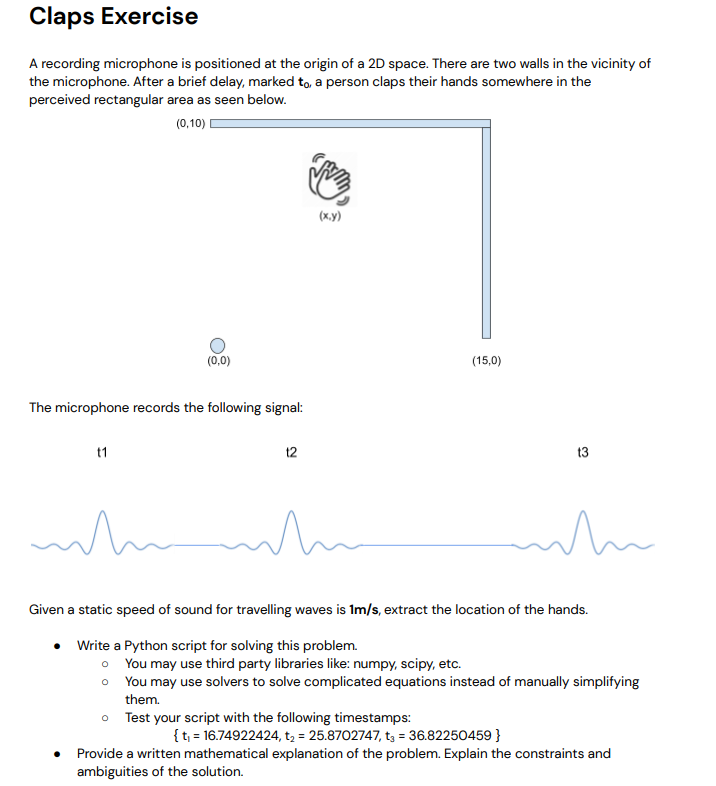

# insoundz_task
This is a repo containing my solution to insoundz interview task.

The question is as follows:

# Mathematical solution
I have decided to take a more abstract solution, and not hard-code things like mic position and wall positions.
Some things could have been done more abstractly, such as allowing for more than two walls and allowing for walls at different angles.
I would have also liked to take into accound reflections off multiple walls, and multiple sound sources.
I have decided to not try and implament these due to time constraints.
I have set my scene to be as follows:
-There is a wall adjascent to x axis: x=15
-There is a wall adjascent to y axis: y=10
-There is a microphone in the room at M(Mx, My)
-There is a clap in the room at C(Cx, Cy)

# Design & Flow:

Some elements from the design were dropped due to time constraints. 
Mainly, my original design had a testing tool and CLI for ease of usage, and testing before or during operation.
Also, while I wrote the abstraction for the RoomConfig class, the functions are not implamented and the config isn't used, also due to time constraints.
